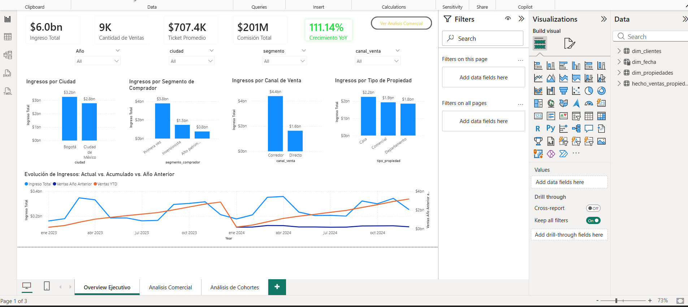
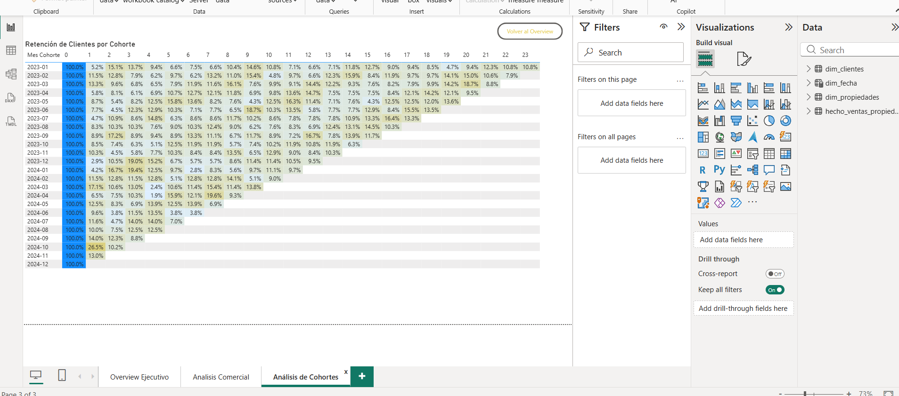

# 🏠 Real Estate Commercial Analysis (Power BI)

> ⚠️ Note: The dashboard visuals are presented in Spanish as part of a real-world business scenario.

## 📌 Project Overview
This project analyzes the commercial performance of a real estate company, focusing on revenue growth, sales channels, customer segmentation, and retention.

## 🎯 Business Questions
* Which property types generate the highest revenue?
* How has the company grown compared to the previous year (YoY)?
* Which sales channels (Brokers vs Direct) perform best?
* What is the customer retention rate over time (cohort analysis)?

## 🗂️ Dataset
* **hecho_ventas_propiedades:** Sales transactions (fact table).
* **dim_clientes:** Customer segmentation.
* **dim_propiedades:** Property attributes.
* **dim_fecha:** Calendar table for time analysis

## 🛠️ Tools & Skills Used
* Power BI (data visualization & dashboard design)
* DAX (time intelligence, cohort analysis, advanced measures)
* Power Query (data cleaning and transformation)

## 📊 Key Metrics
* **Total Revenue:** ~$6B with 111% YoY growth**.
* **Top Property Type:** Houses ("Casa") are the top-performing property type in terms of revenue.
* **Sales Force:** Brokers ("Corredores") drive 72.8% of the total revenue.
* **Retention:** Peak customer recurrence reached 26.5%.

## ✅ Key Learnings
* Built a star schema data model for efficient analysis.
* Developed DAX measures for growth and retention tracking.
* Designed a business-ready dashboard focused on key KPIs.
* Applied cohort analysis to evaluate long-term customer behavior.
  
## 🧩 Data Model
The data model follows a star schema:
- Fact table: sales transactions
- Dimension tables: customers, properties, and date
- One-to-many relationships for accurate aggregations

## 📸 Dashboard Visuals

