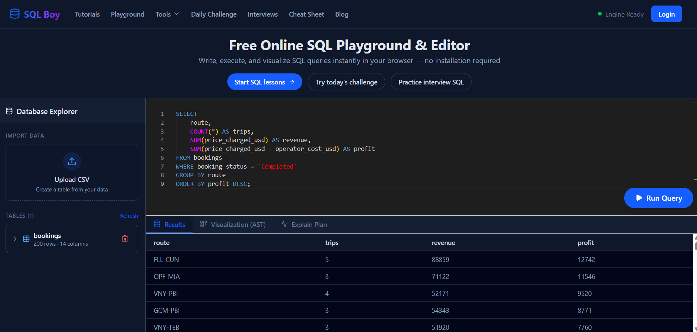
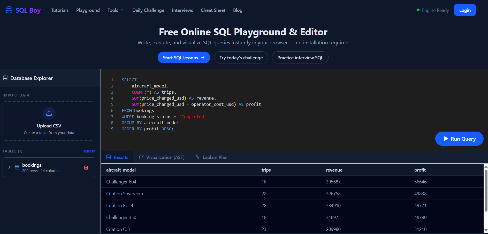

✈️ Private Charter Flight Performance Analysis (SQL)
📌 Project Overview

This project analyzes private charter flight operations to evaluate revenue, cost, and profitability across routes and aircraft.

The objective is to identify which areas of the business generate the most value and support data-driven decision-making.

🎯 Business Questions
Which routes generate the highest profit?
Which aircraft models are the most profitable?
What is the total revenue, cost, and profit?
What percentage of bookings are completed vs cancelled?
📊 Key Insights
Top Routes by Profit

The route FLL–CUN is the most profitable route based on total profit.

Total Trips: 5
Total Revenue: $88,859
Total Profit: $12,742

✈️ Top Aircraft by Profit

The Challenger 604 is the most profitable aircraft model.

Total Trips: 18
Total Revenue: $395,687
Total Profit: $56,646

🛠 Tools & Skills
SQL
Data Aggregation (SUM, COUNT)
Business Metrics (Revenue, Cost, Profit)
Data Analysis

🧠 Key Learnings
Transformed raw operational data into business insights
Analyzed profitability across multiple dimensions (routes and aircraft)
Applied SQL to solve real-world business questions
Structured results for reporting and decision-making

Top Routes by Profit

✈️ Top Aircraft by Profit

