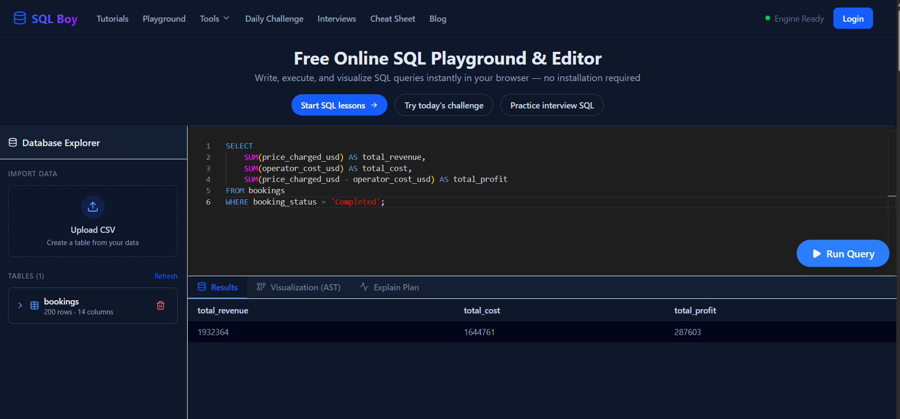
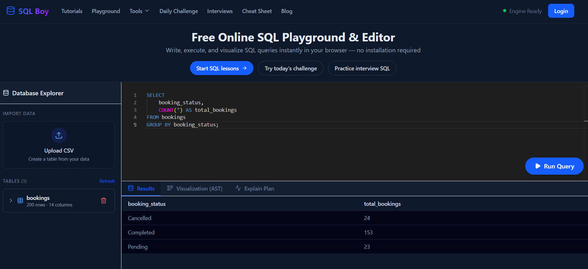
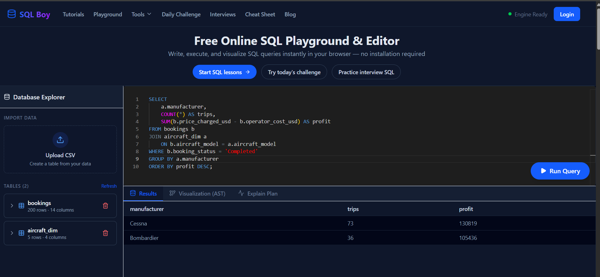

# ✈️ Private Charter Profitability Analysis (SQL Project)

---

## 📊 Project Overview

This project analyzes private charter flight operations to evaluate **revenue, cost, and profitability** across different routes and aircraft models.

The objective is to identify high-performing areas of the business and support **data-driven decision-making**.

---

## 🎯 Business Questions

* Which routes generate the highest profit?
* Which aircraft models are the most profitable?
* What are the total revenue, cost, and profit?
* How many bookings are completed vs canceled?
* Which manufacturers are the most profitable?
---

## 🧠 Key Insights

* 🥇 Most profitable route: **FLL–CUN** ($12,742 profit)

* ✈️ Top aircraft: **Challenger 604** ($56,646 profit)

* 💰 Total revenue: **$1,932,364**

* 🏭 Most profitable manufacturer: Cessna ($130,819 profit) vs Bombardier ($105,436 profit)

* 📉 Total cost: **$1,644,761**

* 📊 Total profit: **$287,603**

---

## 📊 Overall Financial Summary

📌 Aggregated totals from completed bookings:



---

## 📈 Top Routes by Profit

📌 The table below shows the most profitable routes based on completed bookings:


---

## ✈️ Top Aircraft by Profit

📌 The table below ranks aircraft models by total profit:


---

## 📊 Booking Status Distribution

📌 Total number of bookings by status:



💡 Most bookings are completed, indicating strong operational efficiency.


## 🏭 Manufacturer Analysis (Relational Data)

📌 The table below ranks aircraft manufacturers by total profit:




## 🧮 SQL Queries

### 💰 Financial Summary

```sql
SELECT 
    SUM(price_charged_usd) AS total_revenue,
    SUM(operator_cost_usd) AS total_cost,
    SUM(price_charged_usd - operator_cost_usd) AS total_profit
FROM bookings
WHERE booking_status = 'Completed';
```

---

### 📈 Top Routes by Profit

```sql
SELECT 
    route,
    COUNT(*) AS trips,
    SUM(price_charged_usd) AS revenue,
    SUM(price_charged_usd - operator_cost_usd) AS profit
FROM bookings
WHERE booking_status = 'Completed'
GROUP BY route
ORDER BY profit DESC;
```

---

### ✈️ Top Aircraft by Profit

```sql
SELECT 
    aircraft_model,
    COUNT(*) AS trips,
    SUM(price_charged_usd) AS revenue,
    SUM(price_charged_usd - operator_cost_usd) AS profit
FROM bookings
WHERE booking_status = 'Completed'
GROUP BY aircraft_model
ORDER BY profit DESC;
```

---

### 📊 Booking Status Count

```sql
SELECT 
    booking_status,
    COUNT(*) AS total_bookings
FROM bookings
GROUP BY booking_status;


### 🏭 Top Manufacturer by Profit

```sql
SELECT 
    a.manufacturer,
    COUNT(*) AS trips,
    SUM(b.price_charged_usd - b.operator_cost_usd) AS profit
FROM bookings b
JOIN aircraft_dim a
    ON b.aircraft_model = a.aircraft_model
WHERE b.booking_status = 'Completed'
GROUP BY a.manufacturer
ORDER BY profit DESC;

---

## 🛠️ Tools & Skills

* SQL (Aggregations, GROUP BY)
* Data Analysis & Business Metrics
* Profitability Analysis
* Data Interpretation

---

## 💡 Business Impact

* Identified high-profit routes to prioritize operations
* Highlighted most efficient aircraft models
* Supports pricing strategy and route optimization
* Helps reduce focus on low-profit routes

---


