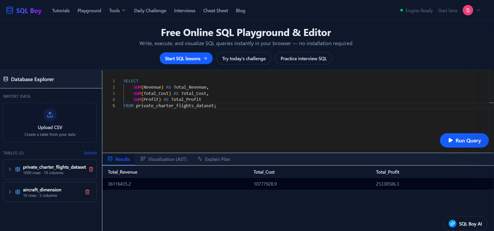
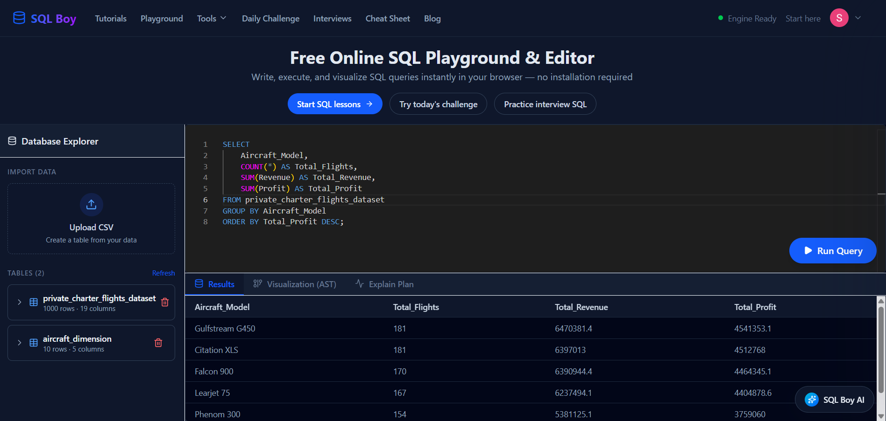
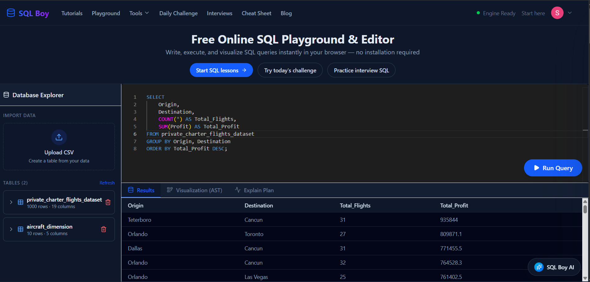
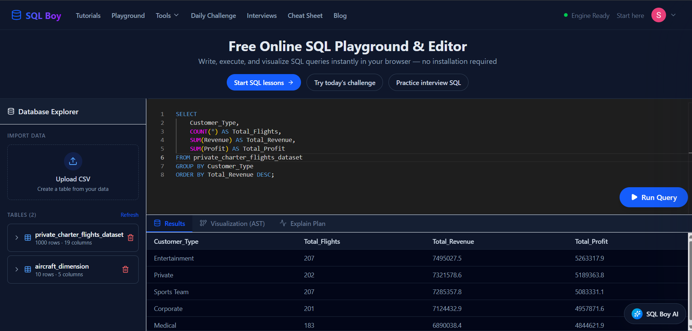
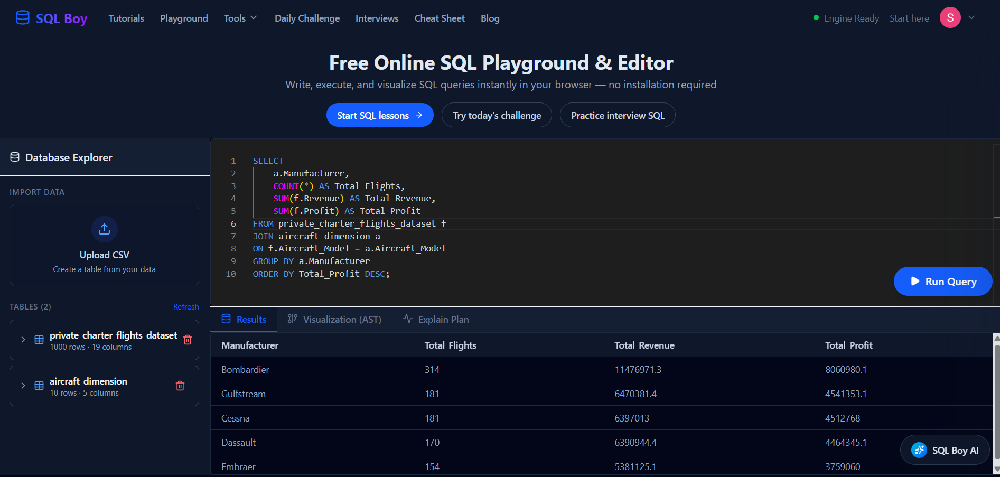

# ✈️ Private Charter Flight Profitability Analysis (SQL Project)

---

## 📊 Project Overview

This project analyzes private charter flight operations to evaluate **financial performance, route profitability, aircraft efficiency, customer segment performance, and manufacturer profitability**.

The objective is to identify high-performing areas of the business and support **business decision-making** using SQL.

---

## 🎯 Business Questions

- What are the company's total revenue, total cost, and total profit?
- Which aircraft models generate the highest profit?
- Which flight routes are the most profitable?
- Which customer type generates the highest revenue?
- Which aircraft manufacturer generates the highest total profit?

---

## 🧠 Key Insights

- 🥇 **Top Route:** Teterboro → Cancun ($935,844 Profit)
- ✈️ **Top Aircraft:** Gulfstream G450 ($4,541,353 Profit | 181 Flights)
- 🏭 **Top Manufacturer:** Bombardier ($8,060,980 Profit | 314 Flights)
- 👥 **Top Customer Segment:** Entertainment ($7,495,028 Revenue | 207 Flights)
- 💰 **Financial Summary:**
  - Total Revenue: **$36,116,435**
  - Total Cost: **$10,777,929**
  - Total Profit: **$25,338,506**

---

## 📊 Visualizations

### 📌 Financial Overview



### 📌 Profitability by Aircraft Model



### 📌 Top Routes Analysis



### 📌 Customer Revenue Analysis



### 📌 Manufacturer Profitability



---

## 🧮 SQL Queries

### 1. Financial Summary

```sql
SELECT
    SUM(Revenue) AS Total_Revenue,
    SUM(Total_Cost) AS Total_Cost,
    SUM(Profit) AS Total_Profit
FROM private_charter_flights_dataset;
```

### 2. Top Aircraft by Profit

```sql
SELECT
    Aircraft_Model,
    COUNT(*) AS Total_Flights,
    SUM(Revenue) AS Total_Revenue,
    SUM(Profit) AS Total_Profit
FROM private_charter_flights_dataset
GROUP BY Aircraft_Model
ORDER BY Total_Profit DESC;
```

### 3. Top Routes by Profit

```sql
SELECT
    Origin,
    Destination,
    COUNT(*) AS Total_Flights,
    SUM(Profit) AS Total_Profit
FROM private_charter_flights_dataset
GROUP BY Origin, Destination
ORDER BY Total_Profit DESC;
```

### 4. Customer Analysis

```sql
SELECT
    Customer_Type,
    COUNT(*) AS Total_Flights,
    SUM(Revenue) AS Total_Revenue,
    SUM(Profit) AS Total_Profit
FROM private_charter_flights_dataset
GROUP BY Customer_Type
ORDER BY Total_Revenue DESC;
```

### 5. Manufacturer Analysis (JOIN)

```sql
SELECT
    a.Manufacturer,
    COUNT(*) AS Total_Flights,
    SUM(f.Revenue) AS Total_Revenue,
    SUM(f.Profit) AS Total_Profit
FROM private_charter_flights_dataset AS f
JOIN aircraft_dimension AS a
    ON f.Aircraft_Model = a.Aircraft_Model
GROUP BY a.Manufacturer
ORDER BY Total_Profit DESC;
```

---

## 🛠️ Tools & Skills

- **SQL**
  - SUM()
  - COUNT()
  - GROUP BY
  - ORDER BY
  - INNER JOIN
- **Data Analysis**
  - Profitability Analysis
  - Revenue Analysis
  - Customer Segmentation
  - Route Performance
- **Data Modeling**
  - Fact & Dimension Tables
  - Relational Database Design
- **Business Intelligence**
  - KPI Analysis
  - Business Decision Support

---

## 💡 Business Impact

- ✈️ Identified the most profitable aircraft models to support fleet optimization.
- 🗺️ Highlighted the highest-performing flight routes for strategic planning.
- 👥 Determined the customer segments generating the highest revenue.
- 🏭 Evaluated aircraft manufacturer performance using relational SQL joins.
- 📊 Provided key business insights through profitability and revenue analysis.

---


